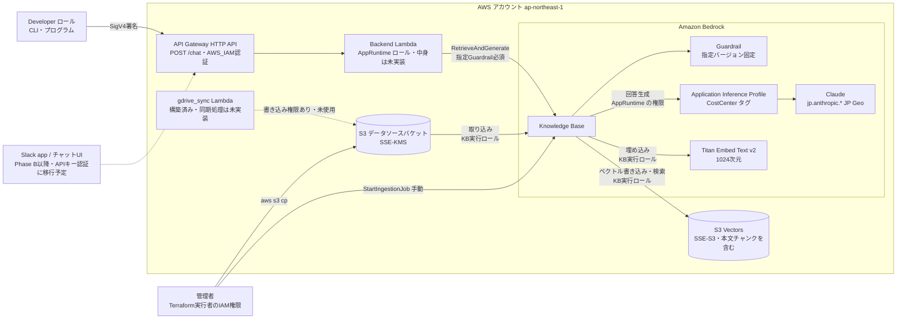
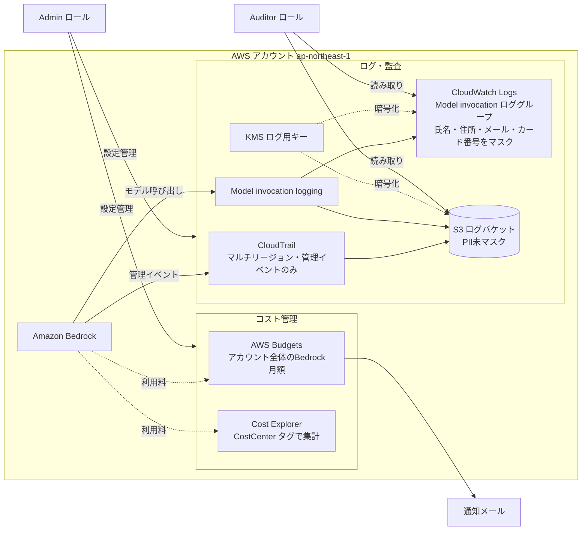

# ユースケース1: 社内RAGチャットボット — 要件・設計

> **2026-09-27、構築を中止**（[#14](https://github.com/poco-poco-takyafumin/aws-try-bedrock/issues/14)）。AWSリソースは全てdestroy済み。中止時点の状態・未完了タスク・再開時の確認事項は、リポジトリ直下の[README.md](../../README.md#01-社内ragチャットボット--中止時点の状態)を参照。

## 背景・目的

- 最終的には企業導入（社内文書RAG）を見据えているが、今回のPoCでは**家庭（世帯）を「組織」に見立てて**開始する。
  - 組織 ≒ 家庭（世帯）、社員 ≒ 本人・家族、社内文書 ≒ 家庭内の機密文書（銀行・保険・取扱説明書・経費等）
  - 加えて個人事業を営んでおり、その顧客情報も対象に含まれうる（企業導入時の「取引先・顧客情報を扱う部門」に相当する要素として、守秘義務・アクセス範囲の設計を先取りして検証する）
- この構造（IAMロール分離・ログ必須化・Guardrails必須化）は家庭規模でも企業規模でも変わらないため、「社内RAGチャットボット」という設計方針・ドキュメント構成はそのまま流用し、対象範囲だけをPoCでは家庭に縮小する。

## 前提の確認（最初に結論を出すべき問い）

- [x] 本当に社内文書RAGが必要か？ SaaS版Claude/ChatGPTの汎用チャットで代替できないか？
  - 代替できない理由: 対象文書をSaaS外部に渡したくない。根拠は以下の複合（企業導入時にはそのまま「社内規程・契約・法令」に対応する論点として引き継ぐ）:
    - 個人の機密情報（銀行口座・保険・資産等）をSaaS事業者側に渡したくない（プライバシー・情報管理上の方針）
    - 個人事業の顧客情報を扱うため、守秘義務相当の管理（自己管理下でのデータ保持）が必要
    - 金融・保険等の情報を含むため、取り扱いに慎重を要する
  - → SaaS版汎用チャットでは代替不可と判断。本ユースケースを進める前提が成立。
  - 企業導入時の展開方向（将来拡張・未決）: 上記の「個人の機密情報」を「社内の機密文書」、「個人事業の顧客」を「取引先・顧客」に読み替えることで企業版に拡張する想定。具体的な企業側の規程・契約・法令の裏付けは企業導入フェーズで別途確認する。
- [x] 対象ユーザー範囲（全社員/特定部門/特定ロール）:
  - PoC範囲: 家庭内ユーザー（本人・家族）＝「特定部門のみ」に相当する規模感。加えて個人事業の顧客対応も将来視野に入れる。
  - 企業導入時は「特定部門のみ」からのスモールスタートを想定（全社展開は将来検討）。
- [x] 扱う文書の機密度・件数・更新頻度:
  - 機密情報・PIIを含む文書も対象（銀行、アカウント情報、取扱説明書、保険、経費など）
  - 更新頻度: 高頻度
  - 件数: 数十〜数百件程度（家庭規模の共有フォルダを想定）

## リージョン・推論プロファイル方針

- 東京リージョン（ap-northeast-1）、推論プロファイルは **`jp.anthropic.*`（JP Geo、東京・大阪限定）を採用**。銀行口座・保険証券等の個人機密情報を扱うため、データ主権を優先

## Guardrailsプロファイル方針

- Content filtersの強度: 高度（全カテゴリ最も厳しい設定。家庭利用・子どもが触れる可能性を考慮）
- Denied topics: 特に制限なし（家庭内利用のため業務外話題の制限は不要。登録文書の範囲内に質問が自然に収まる想定）
- PII filters（ブロック/マスク、対象エンティティ）:
  - 銀行口座番号・保険証券番号等の機密PIIを検出した場合は**本文中の値はブロック/マスク**し、代わりに**出典（Knowledge Baseの引用・元文書へのリンク）を提示**する（ユーザーは元文書側の正規のアクセス経路で確認する）
  - データフローの確認結果: 生データ（PII含む）はモデル呼び出し時にBedrock内のClaudeモデルには渡る（AWS外部には出ない）。Guardrailsは出力段でのマスク/ブロックが基本。Model invocation loggingにより生ログはAWSアカウント内（CloudWatch Logs/S3）に保存される
  - **確認済み事実**（[AWS公式ドキュメント](https://docs.aws.amazon.com/bedrock/latest/userguide/guardrails-sensitive-filters.html)）: Model invocation loggingの`input`フィールドには、Guardrailsのマスク/ブロックに関わらず**マスク前の元データがそのまま記録される**。ブロックされたコンテンツも平文でログに残る。マスクされた値がログに反映されるわけではない
  - → ログ内のPII保護には別途 **CloudWatch Logs data protection**（機密データマスキング機能）の有効化が必要。保護範囲は**金融情報系＋PII系のmanaged data identifiersを広く有効化**する方針（Guardrails側の「標準PIIエンティティを広く適用」と一貫させる）。実際の設定・ポリシー内容は`docs/00`の「ログ出力先（人間レビュー必須）」に該当するため、具体的な設定・diffは実装セッションでレビューする
  - 対象エンティティの詳細: Bedrock Guardrailsの標準PIIエンティティを広く適用（銀行口座番号・クレジットカード番号・住所・電話番号・氏名・Email等）。家族の氏名等が日常会話で頻出し過剰検知の可能性がある点は運用しながら調整
- Contextual grounding check（RAG構成のため基本必須）: しきい値=厳しめ（高しきい値）。銀行口座・保険等の正確性が重要な情報を扱うため、根拠のない推論回答は厳しくブロックする方針

## IAMロール

- このユースケース用AppRuntimeロール名: `bedrock-appruntime-internal-rag-chatbot`
- 呼び出し元（Lambda/ECS等）: **API Gateway + Lambda（サーバーレス）**を単一バックエンドとし、Slack app・チャットUI（Web）・CLI・プログラムからの呼び出しを一元的に受ける構成とする。各IFが個別にBedrockへ直接アクセスしない（docs/00の「1ユースケース=1ロール」原則、Guardrails適用・ログ記録の一元化のため）

## 採用リポジトリ・実装方針

- 土台とするリポジトリ: **`aws-samples/sample-bedrock-knowledge-base-terraform`**（S3/OpenSearch Serverless/Knowledge BaseのRAG構成）に確定
  - ただしベクトルストアはOpenSearch Serverlessではなく **S3 Vectors** を採用する（2026-09-26変更、[#10](https://github.com/poco-poco-takyafumin/aws-try-bedrock/issues/10)）。OpenSearch Serverlessはデータ量・リクエスト量に関係なく最低OCU分が常時課金され、個人PoC規模に対してコストが過大だったため
  - ベクトルバケットの暗号化は既定のSSE-S3とする（旧OpenSearch ServerlessのAWS所有キーと同等。データソースバケットはCMKだが、ベクトル側はコスト・構成の簡素さを優先。暗号化方式はバケット作成後に変更できないため、CMK化する場合はベクトルバケットの再作成が必要）
- カスタマイズが必要な点:
  - データソースはPhase Bの動作確認中は **S3への手動アップロード** を採用する（Google Drive / Notion連携は将来拡張候補）
  - Bedrock Knowledge BaseのデータソースはS3バケットとし、`aws s3 cp` 等で投入した文書をKnowledge Baseが取り込む前提で進める
  - Google Drive同期を将来導入する場合は、`Google Drive API → 同期Lambda（手動実行）→ S3バケット → Knowledge Base(S3データソース)が取り込み` という同期パイプラインを挟む
  - 上記の同期処理を導入する場合は、PIIマスキング・文書ごとのアクセス範囲タグ付けを行う場所として活用する
  - Google Drive連携を将来導入する場合の認可方式: **Google Workspaceのサービスアカウント（ドメイン全体委譲）**
  - Google Drive連携を将来導入する場合の同期対象フォルダの限定方法: **特定の共有ドライブ/フォルダID**を対象とする。フォルダID（非機密）はTerraformにハードコードせず、**SSM Parameter Store（String）**に格納し、LambdaがARN経由で参照する（コード変更・再デプロイなしにフォルダ変更可能にする）
  - Google Drive連携を将来導入する場合のサービスアカウント秘密鍵（JSONキー、機密情報）は**AWS Secrets Manager**で保管する（Parameter Storeとは分離。資格情報はSecrets Managerに一元化）
  - Google Drive連携を将来導入する場合のOAuthスコープは**読み取り専用（`drive.readonly`）**に限定する（最小権限の原則）
  - Google Drive同期を将来導入する場合の初期運用は**手動実行**（EventBridge Schedulerによる自動化は導入しない）。運用が安定したら定期実行化を検討

### データソース方針の見直し（2026-09-23、Phase Bセッションでユーザー確認済み）

上記のGoogle Drive連携は**後回し**とし、Phase Bでは以下を優先する:

- **データ投入方法をS3への手動アップロードに簡素化**する。`gdrive_sync` Lambda（同期パイプライン）を経由せず、`aws s3 cp` 等で対象文書を直接Knowledge BaseのS3データソースバケットに置く
- 扱う文書の性質（銀行・保険・取扱説明書等のPIIを含む家庭の機密文書という想定）は変更しない。Guardrailsプロファイル方針（上記）・PII filters・Contextual grounding checkの設計判断はそのまま維持する。**接続方法（取り込み経路）のみ簡素化**し、まずRAGとしての動作確認を優先する
- Google Drive同期（`modules/gdrive_sync`、issue #7 B-1、PR #8）の実装自体は破棄しない。当時（2026-09-23時点）はPRをオープンのまま保留し、動作確認が済んだ段階で本格導入を再検討する方針だった（将来のB-6候補）
  - → 2026-09-27、構築中止に伴いPR #8はマージせずクローズ（実装はブランチ`feat/07-internal-rag-chatbot-phase-b`に残存）
- 理由: Google Workspaceのドメイン全体委譲設定など外部依存のセットアップ手順が重く、RAGパイプライン本体（Knowledge Base取り込み・チャットバックエンド）の動作確認を先に済ませたい

## アーキテクチャ

2026-09-27の中止直前に `infra/` で構築していた構成（S3 Vectors移行 #10 反映後）。**現在は全てdestroy済み**。点線は未実装・保留のもの、または補助的な関係。

### 1. チャット・取り込みの流れ

### 2. ログ・監査・コスト

### 主要な流れ

- **チャット（問い合わせ）**: 呼び出し元がSigV4署名付きで `POST /chat` を呼ぶ → Backend Lambdaが `bedrock:RetrieveAndGenerate` を実行する。AppRuntimeロールのIAMポリシーで、指定Guardrail（指定バージョン）なしの呼び出しはDenyされる。生成モデルはjp.anthropic.*の推論プロファイル経由に限定され（基盤モデルARNの直接指定は不可）、コスト配分のためバックエンドはタグ付きApplication Inference Profile（`INFERENCE_PROFILE_ARN`）を指定する。回答生成は呼び出し元（AppRuntime）の権限で行われ、KB実行ロールが使うのは取り込み・埋め込み・ベクトル操作のみ。Backend Lambdaの中身はPhase B（B-3）で実装予定で、現状は501を返すプレースホルダー。API Gatewayの認証はB-4でAPIキー方式に置き換える予定
- **取り込み**: 管理者（Terraform実行者のIAM権限。Adminロールには`s3:PutObject`・`bedrock:StartIngestionJob`がない）がS3データソースバケットに文書を手動アップロードし（PR #9の方針）、ingestion jobを手動で起動する → Knowledge BaseがTitan Embed v2で埋め込み、S3 Vectorsに書き込む。S3 Vectorsは既定のSSE-S3で、チャンク本文もメタデータとして保存される。`gdrive_sync` はLambda・IAMロール・Secrets Manager・SSMパラメータまで構築済みで、データソースバケットへの書き込み権限もあるが、同期処理は`main`では未実装（実装はクローズ済みPR #8のブランチにのみ存在）
- **ログ・監査**: Model invocation loggingの出力を、ログ用KMSキーで暗号化したCloudWatch LogsとS3ログバケットに送る。CloudTrailは管理イベントのみ記録する。Knowledge Baseの`Retrieve`／`RetrieveAndGenerate`はCloudTrailではデータイベント扱いのため、現状は記録されない。data protectionでPIIをマスクするのはModel invocationのロググループだけで、対象は氏名・住所・メール・カード番号（日本の口座番号・電話番号は対象外。未決事項参照）。S3宛とLambdaのロググループはマスクされない。本構成で作成するロールのうち、ログの読み取り権限を持つのはAuditorのみ（明示的なDenyはないため、アカウントの管理者権限を持つIAMプリンシパルは読める）
- **コスト**: AWS Budgetsで、アカウント全体のAmazon Bedrock利用料（サービスフィルタ）を監視し、しきい値超過でメール通知する。Claudeの利用料が請求上Marketplaceの別サービス名で計上される場合、このフィルタに含まれない可能性がある（Cost Explorerで要確認）。Application Inference Profileの`CostCenter`タグで、Cost Explorer上でユースケース単位に集計できる。ただしタグが付くのはAIP経由の呼び出しだけで、Titanの埋め込みは対象外。ベクトルストアはS3 Vectors（従量課金）で、常時課金のリソースを持たない

## 未決事項

- CloudWatch Logs data protectionの具体的なポリシー内容・diff（方針＝金融情報＋PII系識別子を広く有効化、は確定済み。実際の設定は`docs/00`の「ログ出力先」人間レビュー必須項目として実装セッションでレビュー）
- 企業導入時に想定される「社内規程・契約・法令」の具体的な裏付け（今回は個人/家庭文脈の理由を記載。企業展開フェーズで別途確認）
- IaCツール統一・アカウント分離方針は `docs/00-architecture-overview.md` の全体未決事項として別管理（本ユースケース固有ではない）
- **Model invocation loggingのS3宛出力に未マスクPIIが残る残存リスク**（コードレビューで指摘）: CloudWatch Logs data protectionはCloudWatch Logs宛のみをマスクし、同等のS3自動マスキング機能は存在しない。現状の緩和策はS3読み取りをAuditorロールに限定することのみ。S3 Object Lambda等での再マスキングパイプライン追加を将来検討する
- **CloudWatch Logs data protectionで日本の銀行口座番号・電話番号を検出できない残存ギャップ**（実装セッションでterraform apply失敗により発覚）: 当初`BankAccountNumber-JP`・`PhoneNumber-JP`をAWS管理データ識別子として指定していたが、AWS公式ドキュメント確認の結果、`BankAccountNumber`はDE/ES/FR/GB/IT/USのみ、`PhoneNumber`はBR/DE/ES/FR/GB/IT/USのみ対応でJPは非対応と判明（`SwiftCode`も管理識別子として存在せず削除）。Guardrails側は日本の銀行口座番号をカスタム正規表現でカバー済みだが、これはモデル入出力のみが対象でCloudWatch Logs宛の生ログには適用されない。CloudWatch Logs data protection policyの`CustomDataIdentifier`（カスタム正規表現）で同等のロジックを追加すれば解消可能（実装セッションのレビューで指摘済み、今回は追加せず残存ギャップとして受容。将来のセッションで追加を検討する）
- ~~**API Gatewayの認証方式**（コードレビューで指摘）~~ → **決定（2026-09-22、Phase Bセッションでユーザー確認済み）**: **APIキー方式**を採用。API Gatewayのusage plan/APIキーで呼び出し元を識別する。Slack app・ChatUI(Web)・CLI・プログラムいずれの呼び出し元にも同一方式を適用し、実装をシンプルに保つ（キー漏洩時の失効・ローテーションは呼び出し元ごとの運用課題として別途管理）。Phase Aの暫定AWS_IAM認証はB-4で置き換える
- **複数環境（poc/prod等）の同時展開方針**（コードレビューで指摘）: `var.environment`はタグ付けにのみ使用しており、`local.name_prefix`（リソース名の素材）には含めていない。AWS側の名前長制約（Knowledge Base実行ロール名64文字上限）に既にほぼ余裕がないため。複数環境を同一AWSアカウントに同時展開する必要が生じた場合は、命名の短縮方針自体の見直しが必要
